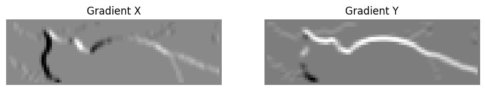
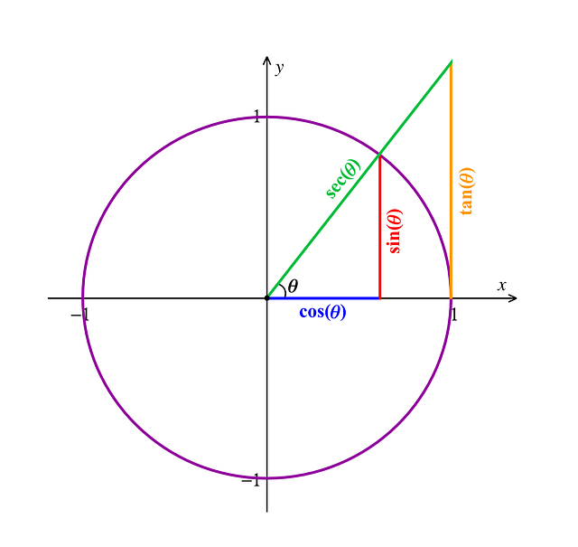
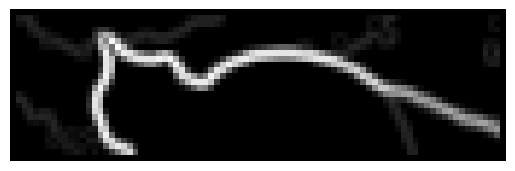
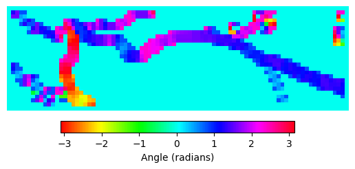
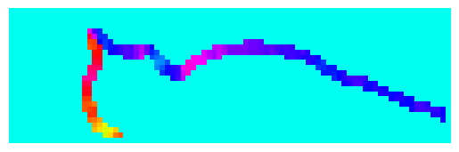
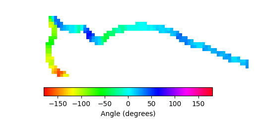
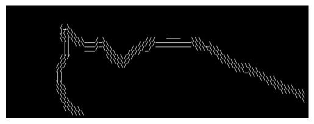
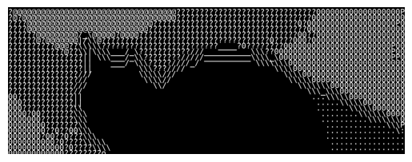

# How to convert an image to ASCII

    There is also an interactive version of README in this repo

## Imports and example image

I will use matplotlib to read image and show progress, numpy to edit image like a 2D array and PIL to finish up and save the new image.


```python
from matplotlib.image import imread
import matplotlib.pyplot as plt
import numpy as np
from PIL import Image, ImageDraw, ImageFont
```

Look at this cat


```python
image = imread("cat.jpg")
plt.imshow(image)
plt.axis("off")
plt.show()
```


    

    


## Grayscale
Colored images are not really 2D matricies because each pixel has several values for color: Red, Green and Blue.

We need to convert those 3 color values to a single "Brightness" value which will correspond to our ASCII characters. I also normalize it to (0,1) because it's a bit more intuitive later on


```python
def grayscale(image, gamma=1.4,
              consts={"r": 0.2126, "g": 0.7152, "b": 0.0722}):
    r, g, b = image[:, :, 0], image[:, :, 1], image[:, :, 2]
    grayscale_image = np.matrix(r*consts["r"]**gamma + g * \
        consts["g"]**gamma + b*consts["b"]**gamma, dtype=np.float32)
    return grayscale_image
```

Now our cat looks like this:


```python
image = grayscale(image)
plt.imshow(image, cmap="gray")
plt.axis("off")
plt.show()
```


    

    


## Downscale

Drawing a character per pixel is too much, considering each character takes several pixels to be readable, so we need to downscale our image and then represent each pixel with character.

This can be done by avaraging the value of a chunk of characters. The size of chunk is equal to some factor by which we downscale


```python
def downscale(image, factor):
    new_size = image.shape[0]//factor, image.shape[1]//factor
    new_image = np.zeros(new_size, dtype=np.float32)
    for i in range(new_size[0]):
        for j in range(new_size[1]):
            new_image[i, j] = image[i * factor : (i + 1) * factor,
                                    j * factor : (j + 1) * factor].mean()
    return new_image
```

I'll downscal by the factor of 16 because it's very visible


```python
downscaled_image = downscale(image, 16)
plt.imshow(downscaled_image, cmap="gray")
plt.axis("off")
plt.show()
```


    

    


## Converting to ascii
Now we are almost ready to convert this image to ASCII charaters.

I'd like to use "■", "@", "#", "*", "+", "=", "-", ":", ".", " " characters, but


```python
print("Min: ", downscaled_image.min())
print("Max: ", downscaled_image.max())

```

    Min:  0.0
    Max:  22.854465
    

See how the max is definately not an intager and also is to big for our list of ASCII character.

We need to reduce the colors. Which is very straightforward - we multiply each pixel by the amout of characters we got and divide it by max value, to get a number between 0 and our list length, also flooring the value by using "//" so we have nice intagers 


```python
# ascii_chars = ("■", "@", "#", "*", "+", "=", "-", ":", ".", " ")
ascii_chars = (" ", ".", ":", "c", "o", "P","0", "?", "@", "■")
downscaled_image = downscaled_image * (len(ascii_chars)-1) // downscaled_image.max()
plt.imshow(downscaled_image, cmap="gray")
plt.axis("off")
plt.show()
```


    

    


Look at these geese. Ordered, rounderd, moisturized.


```python
print("Uniques: ", np.unique(downscaled_image))
```

    Uniques:  [0. 1. 2. 3. 4. 5. 6. 7. 8.]
    

Converting each integer to a character we will get a nice array to draw. 


```python
def grayscale_to_ascii(image, ascii_chars):
    ascii_image = np.empty(image.shape, dtype=str)  # Create empty array for ASCII characters

    for i in range(image.shape[0]):
        for j in range(image.shape[1]):
            pixel_value = image[i, j]
            ascii_image[i, j] =\
                ascii_chars[int(pixel_value)]  # Assign corresponding ASCII character
    return ascii_image
```


```python
ascii_array = grayscale_to_ascii(downscaled_image, ascii_chars)
print(ascii_array[:5, :5])  # Print a small part of the ASCII array
```

    [['?' '@' '@' '@' '@']
     ['?' '@' '?' '@' '@']
     ['?' '?' '?' '?' '@']
     ['?' '?' '?' '?' '@']
     ['?' '?' '?' '?' '?']]
    

And we just draw with pillow (PIL).


```python
def draw_ascii_image(char_matrix, font_path="DejaVuSansMono.ttf", font_size=12, text_color=255, bg_color=0):
    try:
        font = ImageFont.truetype(font_path, font_size)
    except IOError:
        font = ImageFont.load_default()

    # Calculate character size
    bbox = font.getbbox('A')
    char_width = bbox[2] - bbox[0]
    char_height = bbox[3] - bbox[1]

    img_width = char_matrix.shape[1] * char_width
    img_height = char_matrix.shape[0] * char_height

    img = Image.new('L', (img_width, img_height), color=bg_color)
    draw = ImageDraw.Draw(img)

    for y, row in enumerate(char_matrix):
        for x, char in enumerate(row):
            draw.text((x * char_width, y * char_height), str(char), font=font, fill=text_color)

    return img
```


```python
ascii_image = draw_ascii_image(ascii_array, font_size=32)
plt.imshow(ascii_image, cmap="gray")
plt.axis("off")
plt.show()
# ascii_image.show()
```


    

    


## Edge deteciton

Now the more interesting part - edge detection.

There are a couple of methods like differecne of Gaussian or Canny. With mentioned methods conversion of edges to characters would need an aditional detection of direction of the edge using computer vision.

But there is a more convinient method - Sobel operator. 

$G = \begin{bmatrix}
-1 & 0 & 1 \\
-2 & 0 & 2 \\
-1 & 0 & 1
\end{bmatrix}$

By applying this operator on the chunk of image we get the difference between left ad right side of the chunk -- the "edgeness" of it.

Did you notice that it only detects the edge on one axis? We can get the top-to-bottom edges too by rotating the operator


```python
def sobel(image):
    Gx = np.array([[-1, 0, 1],
                  [-2, 0, 2],
                  [-1, 0, 1]])
    Gy = np.array([[1, 2, 1],
                  [0, 0, 0],
                  [-1, -2, -1]])
    gradient_x = np.zeros_like(image)
    gradient_y = np.zeros_like(image)
    for i in range(1, image.shape[0] - 1):
        for j in range(1, image.shape[1] - 1):
            region = image[i-1:i+2, j-1:j+2]
            gradient_x[i, j] = np.sum(region * Gx)
            gradient_y[i, j] = np.sum(region * Gy)
    G = (gradient_x, gradient_y)
    return G
```


```python
sobel_img = sobel(downscaled_image)

figure, ax = plt.subplots(1, 2, figsize=(10, 5))
ax[0].imshow(sobel_img[0], cmap="gray")
ax[0].set_title("Gradient X")
ax[0].axis("off")
ax[1].imshow(sobel_img[1], cmap="gray")
ax[1].set_title("Gradient Y")
ax[1].axis("off")
plt.show()
```


    

    


Well this doesn't really seem convenient. Now we have two images of two different direction of edges. What do we do with them?

The answer is, of course, math.



We can comvine our gradients into one by reffering to triangles and pethagorean theorem.
$$magnitude^2 = G_x^2+G_y^2$$
or, translating
$$magnitude = \sqrt{G_x^2+G_y^2}$$


```python
(Gx, Gy) = sobel(downscaled_image)
magnitudes = np.sqrt(Gx**2 + Gy**2)
plt.imshow(magnitudes, cmap="gray")
plt.axis("off")
plt.show()
```


    

    


Now we have some beautiful edges. A bit messy but we can clearly see the subject of the image.

But how do we avoid the task of classifying the angles of those edges using computer vison? Are we not using Sobel just to avoid that?

Well..

It's time for everyone's favorite unlikely alliance -- inverse of tangent...

For those like me who didn't have an unhealthy love for trigonometry let's just say it's some magic function that translates our two edges strengths into a direction.


```python
angles = np.arctan2(Gy, Gx)
im = plt.imshow(angles, cmap="hsv")
plt.axis("off")
cbar = plt.colorbar(im, orientation='horizontal', fraction=0.046, pad=0.04)
cbar.set_label('Angle (radians)')
plt.show()
```


    

    


Now each pixel or cell of our 2D array represents a degree (in radians), which we can replace with a special character.

But first let's tidy it up. By thresholding the magnitude we can limit the sensativity of our edge detection.


```python
threshold = 0.3
sobel_img = sobel(downscaled_image)

magnitudes = np.sqrt(sobel_img[0]**2 + sobel_img[1]**2)
magnitudes = magnitudes/magnitudes.max()  # Normalize magnitudes

sobel_filtered = np.arctan2(sobel_img[1], sobel_img[0])  # Calculate the angle of the gradient
sobel_filtered[magnitudes < threshold] = 0  # Filter out weak edges

plt.imshow(sobel_filtered, cmap="hsv", vmin=-np.pi, vmax=np.pi)
plt.axis("off")
plt.show()
```


    

    


Let's update our sobel method.


```python
def sobel(image, magnitude_threshhold:float=0):
    assert magnitude_threshhold >= 0 and magnitude_threshhold <= 1
    Gx = np.array([[-1, 0, 1],
                  [-2, 0, 2],
                  [-1, 0, 1]])
    Gy = np.array([[1, 2, 1],
                  [0, 0, 0],
                  [-1, -2, -1]])
    
    gradient_x = np.zeros(image.shape)
    gradient_y = np.zeros(image.shape)
    
    for i in range(1, image.shape[0] - 1):
        for j in range(1, image.shape[1] - 1):
            region = image[i-1:i+2, j-1:j+2]
            gradient_x[i, j] = np.sum(region * Gx)
            gradient_y[i, j] = np.sum(region * Gy)
    
    magnitude = np.sqrt(gradient_x**2 + gradient_y**2)
    magnitude = magnitude/magnitude.max()  # Normalize magnitude
    # filter = magnitude > magnitude_threshhold
    # G = np.zeros(image.shape)
    G = np.arctan2(gradient_x, gradient_y)  # Calculate angle
    G[magnitude < magnitude_threshhold] = None  # Filter out weak edges
    return G
```

Translating radians to degrees because it's a bit easier to understand


```python
sobel_deg = np.rad2deg(sobel(downscaled_image, magnitude_threshhold=0.3))
im = plt.imshow(sobel_deg, cmap="hsv", vmin=-180, vmax=180)
cbar = plt.colorbar(im, orientation='horizontal', fraction=0.046, pad=0.04)
cbar.set_label('Angle (degrees)')
plt.axis("off")
plt.show()
```


    

    


We can now translate those angles to the right symbol


```python
# Edges in format "Vertical", "Horizontal", "Diagonal1", "Diagonal2"
def generate_edges(degrees_array, cardinal_threshhold, edges = ("|","_","\\","/")):
    edges_array = np.empty(degrees_array.shape, dtype=str)
    for i in range(degrees_array.shape[0]):
        for j in range(degrees_array.shape[1]):
            angle = degrees_array[i, j]
            if np.isnan(angle):
                edges_array[i, j] = " "
            else:
                # Map angle to edge character
                deg = angle % 360
                if deg <= cardinal_threshhold:
                    edges_array[i, j] = edges[1] # _
                elif deg < 90 - cardinal_threshhold:
                    edges_array[i, j] = edges[2] # \
                elif deg <= 90 + cardinal_threshhold:
                    edges_array[i, j] = edges[0] # |
                elif deg < 180 - cardinal_threshhold:
                    edges_array[i, j] = edges[3] # /
                elif deg < 180 + cardinal_threshhold:
                    edges_array[i, j] = edges[1] # _
                elif deg < 270 - cardinal_threshhold:
                    edges_array[i, j] = edges[2] # \
                elif deg < 270 + cardinal_threshhold:
                    edges_array[i, j] = edges[0] # |
                elif deg < 360 - cardinal_threshhold:
                    edges_array[i, j] = edges[3] # /
                else:
                    edges_array[i, j] = edges[1] # _
    return edges_array
```


```python
edges_array = generate_edges(sobel_deg, cardinal_threshhold=10)
edges_img = draw_ascii_image(edges_array, font_size=32)
plt.imshow(edges_img, cmap="gray")
plt.axis("off")
plt.show()
# edges_img.show()
```


    

    


Layering our images we get a clearly edged little cat with background


```python
np.copyto(edges_array, ascii_array, where=edges_array == " ")
final_image = draw_ascii_image(edges_array, font_size=32)
plt.imshow(final_image, cmap="gray")
plt.axis("off")
plt.show()
# final_image.save("ascii_art.png")
# final_image.show()

```


    

    


## Afterword

There is a lot of things you can modify here, like making the edges thinner or adding OCR and drawing letters with themselves but I'll stop here _for now_.

It is a very fun project and if you are interested in the topic I highly recommend [this video](https://youtu.be/gg40RWiaHRY) by Acerola of how makes this effect a videogame shader.

Also there's [this Computerphile video](https://youtu.be/uihBwtPIBxM) that explains the Sobel operator better than I do.

See ya.
