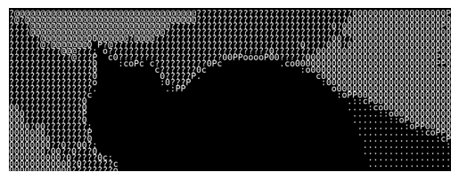

# How to convert an image to ASCII

## Imports and example image

I will use matplotlib to read image and show progress, numpy to edit image like a 2D array and PIL to finish up and save the new image.


```python
from matplotlib.image import imread
import matplotlib.pyplot as plt
import numpy as np
from PIL import Image, ImageDraw, ImageFont
```

Look at this cat


```python
image = imread("cat.jpg")
plt.imshow(image)
plt.axis("off")
plt.show()
```


    

    


## Grayscale
Colored images are not really 2D matricies because each pixel has several values for color: Red, Green and Blue.

We need to convert those 3 color values to a single "Brightness" value which will correspond to our ASCII characters. I also normalize it to (0,1) because it's a bit more intuitive later on


```python
def grayscale(image, gamma=1.4,
              consts={"r": 0.2126, "g": 0.7152, "b": 0.0722}):
    r, g, b = image[:, :, 0], image[:, :, 1], image[:, :, 2]
    grayscale_image = np.matrix(r*consts["r"]**gamma + g * \
        consts["g"]**gamma + b*consts["b"]**gamma, dtype=np.float32)
    return grayscale_image
```

Now our cat looks like this:


```python
image = grayscale(image)
plt.imshow(image, cmap="gray")
plt.axis("off")
plt.show()
```


    

    


## Downscale

Drawing a character per pixel is too much, considering each character takes several pixels to be readable, so we need to downscale our image and then represent each pixel with character.

This can be done by avaraging the value of a chunk of characters. The size of chunk is equal to some factor by which we downscale


```python
def downscale(image, factor):
    new_size = image.shape[0]//factor, image.shape[1]//factor
    new_image = np.zeros(new_size, dtype=np.float32)
    for i in range(new_size[0]):
        for j in range(new_size[1]):
            new_image[i, j] = image[i * factor : (i + 1) * factor,
                                    j * factor : (j + 1) * factor].mean()
    return new_image
```

I'll downscal by the factor of 16 because it's very visible


```python
downscaled_image = downscale(image, 16)
plt.imshow(downscaled_image, cmap="gray")
plt.axis("off")
plt.show()
```


    

    


## Converting to ascii
Now we are almost ready to convert this image to ASCII charaters.

I'd like to use "■", "@", "#", "*", "+", "=", "-", ":", ".", " " characters, but


```python
print("Min: ", downscaled_image.min())
print("Max: ", downscaled_image.max())

```

    Min:  0.0
    Max:  22.854465
    

See how the max is definately not an intager and also is to big for our list of ASCII character.

We need to reduce the colors. Which is very straightforward - we multiply each pixel by the amout of characters we got and divide it by max value, to get a number between 0 and our list length, also flooring the value by using "//" so we have nice intagers 


```python
ascii_chars = ("■", "@", "#", "*", "+", "=", "-", ":", ".", " ")
downscaled_image = downscaled_image * (len(ascii_chars)-1) // downscaled_image.max()
plt.imshow(downscaled_image, cmap="gray")
plt.axis("off")
plt.show()
```


    

    


Look at these geese. Ordered, rounderd, moisturized.


```python
print("Uniques: ", np.unique(downscaled_image))
```

    Uniques:  [0. 1. 2. 3. 4. 5. 6. 7. 8.]
    

Converting each integer to a character we will get a nice array to draw. 


```python
def grayscale_to_ascii(image, ascii_chars):
    ascii_image = np.empty(image.shape, dtype=str)  # Create empty array for ASCII characters

    for i in range(image.shape[0]):
        for j in range(image.shape[1]):
            pixel_value = image[i, j]
            ascii_image[i, j] =\
                ascii_chars[int(pixel_value)]  # Assign corresponding ASCII character
    return ascii_image
```


```python
ascii_array = grayscale_to_ascii(downscaled_image, ascii_chars)
print(ascii_array[:5, :5])  # Print a small part of the ASCII array
```

    [[':' '.' '.' '.' '.']
     [':' '.' ':' '.' '.']
     [':' ':' ':' ':' '.']
     [':' ':' ':' ':' '.']
     [':' ':' ':' ':' ':']]
    

And we just draw with pillow (PIL).


```python
def draw_ascii_image(char_matrix, font_path="DejaVuSansMono.ttf", font_size=12, text_color=0, bg_color=255):
    try:
        font = ImageFont.truetype(font_path, font_size)
    except IOError:
        font = ImageFont.load_default()

    # Calculate character size
    bbox = font.getbbox('A')
    char_width = bbox[2] - bbox[0]
    char_height = bbox[3] - bbox[1]

    img_width = char_matrix.shape[1] * char_width
    img_height = char_matrix.shape[0] * char_height

    img = Image.new('L', (img_width, img_height), color=bg_color)
    draw = ImageDraw.Draw(img)

    for y, row in enumerate(char_matrix):
        for x, char in enumerate(row):
            draw.text((x * char_width, y * char_height), str(char), font=font, fill=text_color)

    return img
```


```python
ascii_image = draw_ascii_image(ascii_array, font_size=32)
plt.imshow(ascii_image, cmap="gray")
plt.axis("off")
plt.show()
```


    

    


## Afterword
This is not the end, as I woul like to display the edges with "|", "_", "\\" and "/" characters to show Sobel edge detection method
